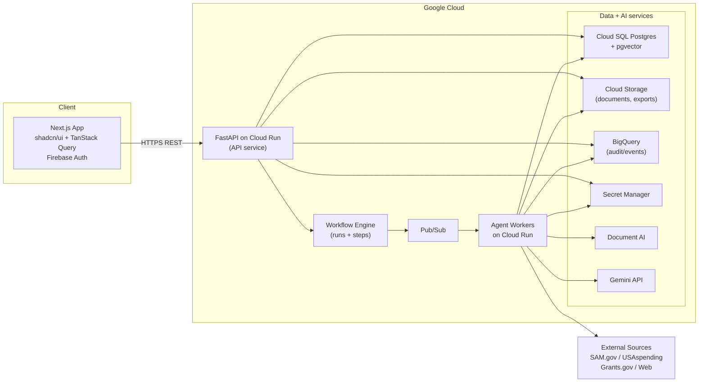
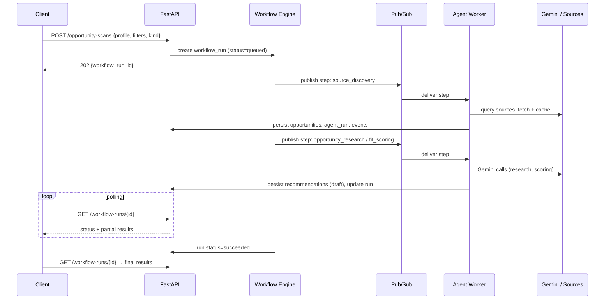
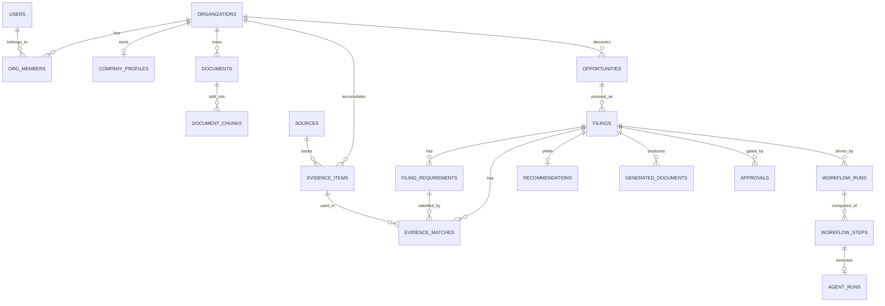
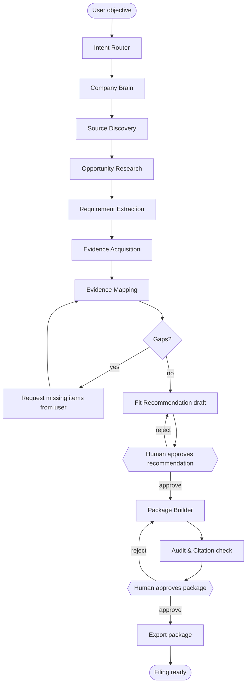

# CaptureOS — Software Engineering PRD

| Field | Value |
|---|---|
| **Document** | Software Engineering Product Requirements Document |
| **Product** | CaptureOS — AI Filing OS for small businesses |
| **Version** | 1.0 (initial engineering draft) |
| **Status** | Draft — ready for build planning |
| **Owner** | _(assign)_ |
| **Last updated** | 2026-06-18 |
| **Target reader** | Engineering team / autonomous coding agent (e.g. Claude Code) |
| **Related docs** | Architecture deep-dive, Agent/Workflow spec, GTM/hackathon plan _(separate, not in scope here)_ |

---

## 0. How to read this document

This is an **engineering** PRD. It specifies *what to build and how it is structured*, with testable requirements, interface contracts, a data model, and delivery milestones. It deliberately does **not** include marketing plans, outreach scripts, or pricing strategy — those become engineering requirements only where they touch the system (billing, usage metering, audit evidence). Where the source brief listed strategy or GTM deliverables, those are out of scope for this document and noted in §16.

Requirements are tagged for traceability:

- `FR-*` functional requirement (a behavior the system must exhibit)
- `NFR-*` non-functional requirement (quality attribute)
- `CON-*` hard constraint (must never be violated)

Every `FR-*` is written to be independently testable.

---

## 1. Summary (TL;DR)

CaptureOS is a **filing orchestration system** for small businesses. A business owner connects what they already use (website, optional docs, optional UEI), states an objective ("find contracts and grants I qualify for and prepare the filing"), and the system runs a pipeline of specialized AI agents that research opportunities, extract requirements, gather and map evidence, score fit, and assemble a **filing-ready, source-backed package** — with a human approving anything consequential.

The central domain object is a **Filing**. Everything the system produces hangs off a Filing: its target opportunity, requirements, eligibility rules, evidence found/missing, generated documents, recommendation, approvals, and full audit trail.

The MVP delivers two revenue verticals — **government contracts (GovCon)** and **grants** — across five workflows (Company Brain → Opportunity Scan → Requirement Extraction → Evidence Matching → Package Build), plus an audit/logs surface and billing. Permits/licenses are an explicit future vertical and must not require schema rewrites.

**Non-negotiable behaviors:** (1) the system never auto-submits a binding external filing — a human approves first; (2) every claim-bearing output is source-backed; (3) every agent action is logged to an exportable audit trail.

---

## 2. Problem statement

Small businesses lose enormous time on the *research-and-preparation* phase of business-critical filings (contracts, grants, permits, certifications, onboarding packets). The work is high-stakes, deadline-driven, and requires synthesizing scattered internal evidence against external requirements. Existing tools solve thin slices (RFP summarizers, grant-writing assistants, checklist apps) but none orchestrate the end-to-end pipeline: *discover → research → extract requirements → gather evidence → check eligibility → recommend → assemble package*, with citations and an audit trail.

CaptureOS targets that orchestration gap. It is not a chatbot and not a document summarizer; it behaves like an AI back-office team.

---

## 3. Goals and non-goals

### 3.1 Goals (MVP)

1. Let an org build a structured **Company Brain** from minimal input (name + website, optionally UEI/docs).
2. Discover and rank **GovCon and grant opportunities** the org plausibly qualifies for, with fit scores and source-backed reasoning.
3. **Extract requirements** from RFPs / NOFOs / pasted or uploaded solicitation text.
4. **Map requirements to evidence**, flag gaps, and request missing items from the user.
5. Produce **bid/no-bid and apply/no-apply recommendations** with explicit rationale and citations.
6. Generate an **exportable filing package** (compliance matrix, narrative drafts, attachment checklist, missing-item checklist) in Markdown/PDF/DOCX.
7. Enforce **human-in-the-loop** approval before a recommendation is committed and before a package is finalized/exported.
8. Record a complete, **exportable audit trail** of every agent run, source checked, Gemini call, and user action.
9. Support **billing** and persist **revenue records** (for both real monetization and hackathon evidence).
10. Use **Gemini API** for at least one LLM call in the deployed app and at least one **Google Cloud** product in production (the architecture uses several).

### 3.2 Non-goals (MVP)

- No autonomous external submission of any filing (see `CON-1`).
- No permit/license/certification/vendor/insurance/inspection verticals beyond schema-readiness (future).
- No mobile-native app (responsive web only).
- No real-time multi-user collaborative editing of drafts (single-editor with versioning is enough).
- No fine-tuned/self-hosted models (use Gemini + managed GCP AI services).
- No marketplace, no public opportunity directory, no white-label.

---

## 4. Users and domain concepts

### 4.1 Primary users

| Persona | Description | Primary jobs in CaptureOS |
|---|---|---|
| **Owner-operator** | Runs a small business / nonprofit; little back-office capacity. | Connect company, state objective, review recommendations, approve packages. |
| **Capture/grants lead** (later) | At a slightly larger SMB; manages pursuits. | Triage opportunities, edit narratives, manage submission checklists. |
| **CaptureOS operator** (internal) | Delivers paid "Filing Sprint" service on top of the product. | Run workflows on behalf of clients, monitor logs/quality. |

### 4.2 Domain concepts (glossary for implementers)

| Term | Meaning in this system |
|---|---|
| **Company Brain** | Structured profile of the org (services, NAICS guesses, certifications, past performance, capability statement) derived from website/docs/public sources. Stored in `company_profiles` + `evidence_items`. |
| **Evidence Vault** | The org's accumulated `evidence_items` (atomic, sourced facts) reusable across filings. |
| **Filing** | The central object. A pursuit of one opportunity of a given `kind`. Aggregates requirements, evidence matches, recommendation, generated docs, approvals, audit. |
| **Opportunity** | An external thing to pursue (a contract solicitation, a grant NOFO, later a permit). Unified table with a `kind` discriminator. |
| **Requirement** | A discrete, must-satisfy condition extracted from a solicitation (e.g. "provide past-performance references", "be SAM-registered"). |
| **Evidence match** | The link between a requirement and the evidence that satisfies it, with status (matched / partial / missing / user_provided). |
| **Workflow run** | One execution of a multi-step pipeline for an org/filing; composed of `workflow_steps`, each driving one `agent_run`. |
| **Citation** | A reference from a claim to a `source` (URL/doc) plus a locator. No claim ships without one. |

---

## 5. Functional requirements

### 5.1 Company Brain (`FR-CB-*`)

- **FR-CB-1** — Accept inputs: company name (required), website URL, industry, location, optional UEI, optional uploaded documents, optional free-text description.
- **FR-CB-2** — Ingest the website URL (fetch + parse primary pages) and produce structured profile fields: services, target customers, NAICS guesses (with confidence), funding/grant categories, certifications detected vs. likely-missing, and past-performance evidence found.
- **FR-CB-3** — Produce a **capability-statement draft** from the profile and a **missing-information checklist** listing fields that could not be populated.
- **FR-CB-4** — Persist each derived fact as an `evidence_item` with a `source` reference (which page/document it came from).
- **FR-CB-5** — Allow the user to edit/confirm/override any profile field; user overrides are themselves stored as `user_provided` evidence and take precedence over inferred values.
- **FR-CB-6** — The profile must be regenerable/refreshable on demand without destroying user overrides.

### 5.2 Document ingestion & RAG (`FR-DI-*`)

- **FR-DI-1** — Accept uploads (PDF, DOCX, common image formats); store the binary in Cloud Storage; create a `documents` row.
- **FR-DI-2** — Extract text/structure using Document AI (with a plain-text fallback extractor for simple files); chunk into `document_chunks`; embed each chunk and store the vector for retrieval.
- **FR-DI-3** — Support pasting raw solicitation text (no file) and treat it as an ingestable document.
- **FR-DI-4** — Support an **optional Google Drive folder connection**; for MVP a *simulated connector* (user provides a folder export or selected files) is acceptable, behind the same internal interface as a future real connector.
- **FR-DI-5** — Retrieval (RAG) must return chunks with their `document_id` + locator so downstream citations resolve to a source.
- **FR-DI-6** — Ingestion is idempotent: re-uploading the same file does not duplicate chunks/evidence (dedupe by content hash).

### 5.3 Opportunity discovery & GovCon scanner (`FR-OD-*`, `FR-GC-*`)

- **FR-OD-1** — Accept scan inputs: company profile reference, keywords, NAICS codes, target agencies/funders, location, size/contract preferences, and `kind` (gov_contract | grant).
- **FR-OD-2** — Discover opportunities from external sources appropriate to the kind (GovCon: SAM.gov opportunities, USAspending award history; Grants: Grants.gov / public listings), plus any pasted/uploaded solicitations. External-source specifics are confirmed at build time (see §15).
- **FR-OD-3** — Persist discovered opportunities to `opportunities` with `source` references and a content snapshot (so results are auditable even if the live source changes).
- **FR-GC-1** — For each opportunity, compute a **fit score** (0–100) and a **bid/no-bid** indication, with an explicit rationale referencing profile + opportunity facts.
- **FR-GC-2** — Produce an agency-research summary and prior-award research (from USAspending) for top-ranked opportunities.
- **FR-GC-3** — Produce a competition/risk estimate (qualitative + a coarse score) with stated assumptions.
- **FR-GC-4** — Output, per opportunity: required documents, missing evidence, a compliance matrix stub, a proposal outline, and a submission checklist.
- **FR-OD-4** — Scans are long-running and run asynchronously; the API returns a `workflow_run_id` and the client polls for progress/results (see §9.4).
- **FR-OD-5** — All external fetches are cached and rate-limited to respect source terms (see `NFR-7`).

### 5.4 Grant scanner (`FR-GR-*`)

- **FR-GR-1** — Accept inputs: company/nonprofit profile, mission/industry, location, funding need, eligibility constraints.
- **FR-GR-2** — Discover grant opportunities, persist them as `opportunities` with `kind = grant`.
- **FR-GR-3** — Compute eligibility fit score and apply/no-apply indication with rationale.
- **FR-GR-4** — Output: application requirements, missing documents, narrative outline, draft grant responses, budget checklist, submission checklist.

### 5.5 Requirement extraction (`FR-RE-*`)

- **FR-RE-1** — Given an opportunity's solicitation text/documents, extract a structured list of `filing_requirements`: each with normalized text, category (e.g. eligibility, technical, past_performance, certification, formatting, attachment), a `mandatory` flag, and a `source` reference (section/locator).
- **FR-RE-2** — Extraction output must be schema-validated (Pydantic); malformed model output triggers a bounded retry (see §10.5), then a flagged-for-review state rather than a silent failure.
- **FR-RE-3** — Deduplicate near-identical requirements; preserve the source locator for each.

### 5.6 Evidence matching & gaps (`FR-EM-*`)

- **FR-EM-1** — For each requirement, search the Evidence Vault (profile + document chunks + connected sources) and produce zero or more `evidence_matches` with a match score and status (matched / partial / missing).
- **FR-EM-2** — Produce a consolidated **gap list** (requirements with status partial/missing) and a **missing-item checklist** suitable for sending to the user as a file request.
- **FR-EM-3** — Allow the user to satisfy a gap by uploading a document or entering a value; the new evidence re-runs matching for the affected requirement(s) and flips status to `matched`/`user_provided`.
- **FR-EM-4** — The compliance matrix is derived from `filing_requirements` ⋈ `evidence_matches` and must always reflect current match state.

### 5.7 Recommendation engine (`FR-RC-*`)

- **FR-RC-1** — Produce a per-filing recommendation object: decision (`pursue` / `do_not_pursue` for the relevant kind), a score, and a structured rationale citing the specific facts/evidence/gaps that drove it.
- **FR-RC-2** — The recommendation must surface the top reasons *for* and *against*, and the most impactful missing evidence.
- **FR-RC-3** — A recommendation is a **draft** until a human approves it (see `FR-AP-1`).

### 5.8 Filing package builder (`FR-PB-*`)

- **FR-PB-1** — Given an approved filing, generate the package artifacts as `generated_documents`: compliance matrix, narrative/proposal sections (per outline), attachment checklist, missing-item checklist, and a source-citation appendix.
- **FR-PB-2** — Every generated narrative claim must carry a citation resolvable to a `source` or `evidence_item`; the Audit/Citation step rejects or flags any unsourced claim before the package is marked ready.
- **FR-PB-3** — Export the package as **Markdown, PDF, and DOCX**; exports are versioned and stored in Cloud Storage.
- **FR-PB-4** — A package cannot be exported/finalized until (a) the recommendation is approved and (b) the package itself passes a human review approval (see `CON-1`, `FR-AP-2`).
- **FR-PB-5** — Generated documents are versioned; regenerating produces a new version without discarding prior versions or user edits.

### 5.9 Human-in-the-loop approvals (`FR-AP-*`)

- **FR-AP-1** — Before a filing's recommendation is treated as "pursue," it must be explicitly approved by an authorized org user; the approval (who/when/decision) is persisted.
- **FR-AP-2** — Before a package is finalized/exported, it must pass an explicit human review approval.
- **FR-AP-3** — Approval state is visible in the UI and recorded in the audit trail; rejection routes the filing back to an editable state with the reviewer's notes.

### 5.10 Audit, logs & evidence (`FR-AU-*`)

- **FR-AU-1** — Persist, for every workflow run: each step, the agent invoked, inputs, outputs (or output summary + pointer), model used, token counts, latency, and status.
- **FR-AU-2** — Persist every external source checked, every document processed, every Gemini call, every recommendation/package generated, every user action, every approval, and every error.
- **FR-AU-3** — Compute and store a **time-saved estimate** per workflow run (configurable heuristic, e.g. per-artifact baseline minutes).
- **FR-AU-4** — Surface a **logs/activity dashboard** in the UI showing runs, steps, sources, and metrics.
- **FR-AU-5** — The audit trail must be **exportable** (CSV/JSON) for external review (hackathon evidence). Authoritative event stream lives in BigQuery; transactional run/step summaries live in Postgres for the UI.

### 5.11 Billing & revenue (`FR-BL-*`)

- **FR-BL-1** — Integrate a payment provider (Stripe assumed) for one-time charges (Filing Readiness Audit, Filing Sprint) and a monthly subscription (filing autopilot).
- **FR-BL-2** — Persist `subscriptions` and `revenue_records`; gate premium workflows on entitlement.
- **FR-BL-3** — Record each successful charge with amount, product, org, and timestamp (real revenue + hackathon evidence).

---

## 6. Constraints (hard rules)

- **CON-1** — The MVP **must never** auto-submit a binding external filing (no posting to SAM.gov, Grants.gov, agency portals, etc.). The system researches, recommends, prepares, pre-fills, packages, and *guides* submission only. A human submits externally.
- **CON-2** — No claim-bearing output (profile fact, recommendation rationale, narrative sentence) ships without a resolvable citation to a `source` or `evidence_item`.
- **CON-3** — Every agent action that touches data or an external source is logged to the audit trail.
- **CON-4** — Secrets (API keys, provider tokens) live only in Secret Manager and are never sent to the client.
- **CON-5** — All data access is org-scoped; one org can never read another org's data.

---

## 7. System architecture

### 7.1 Overview

A responsive Next.js client talks over HTTPS REST to a FastAPI service on Cloud Run. Short requests (CRUD, reads, approvals) are handled synchronously. Long-running pipelines (scans, extraction, package builds) are dispatched to a lightweight workflow engine that enqueues steps on Pub/Sub; Cloud Run worker(s) execute agents, which call Gemini, Document AI, and external sources, and write back to Postgres, Cloud Storage, and BigQuery. The client polls run status.

### 7.2 Technology decisions

| Layer | Choice | Rationale | Noted alternative |
|---|---|---|---|
| Frontend | Next.js + TypeScript + Tailwind + shadcn/ui + TanStack Query | Matches brief; TanStack Query fits the poll-for-async pattern. | — |
| Auth | Firebase Auth | Stays in GCP ecosystem (helps GCP-usage criterion); easy Next.js integration. | Clerk (better DX; acceptable) |
| API | FastAPI + Pydantic on Cloud Run | Typed contracts; Pydantic doubles as agent I/O validation. | — |
| Async | Pub/Sub + Cloud Run workers | Decouples long agent pipelines from request latency. | Cloud Tasks |
| Orchestration | **Custom workflow engine** (`workflow_runs`/`workflow_steps`) | Simpler, fully observable, maps 1:1 to the audit requirement. | LangGraph (optional, if graph complexity grows) |
| Core DB | Cloud SQL **Postgres + pgvector** | The model is highly relational (filing→requirements→matches→evidence); pgvector keeps RAG in the same store. | Firestore + Vertex Vector Search |
| Blob store | Cloud Storage | Documents + exported packages. | — |
| Audit/analytics | BigQuery | Append-only event stream; cheap analytics; powers dashboards/exports. | — |
| LLM | **Gemini API** (Pro tier for reasoning-heavy agents, Flash tier for cheap extraction) | Required by hackathon; tiering controls cost. | Vertex-hosted Gemini |
| Doc parsing | Document AI | Robust PDF/scan extraction. | Plain-text fallback for simple files |
| Embeddings | Managed text-embedding model (Vertex/Gemini embeddings) | Powers pgvector retrieval. | Confirm exact model at build time |
| Secrets | Secret Manager | `CON-4`. | — |
| Billing | Stripe | Mature; webhooks → `revenue_records`. | — |

> **Why unify `opportunities` and `grants`:** the source brief lists them separately, but contracts and grants share the same structure (title, sponsor, deadline, source URL, raw text, requirements). The model uses a single `opportunities` table with a `kind` discriminator and a `details` JSON column for kind-specific fields. This keeps Filing logic uniform and makes the permit/license verticals additive (new `kind`, no schema rewrite). The brief's separate entities map cleanly (see §8.5).

### 7.3 Architecture diagram



### 7.4 Async workflow lifecycle (representative: opportunity scan)



---

## 8. Data model

Postgres is authoritative for transactional/relational data; BigQuery holds the append-only audit event stream; Cloud Storage holds binaries.

### 8.1 Core ER diagram (Filing-centric cluster)



### 8.2 Key table definitions

Conventions: every table has `id uuid pk`, `org_id uuid` (except global `users`), `created_at`, `updated_at`. All non-`users` queries are filtered by `org_id` (`CON-5`).

**`organizations`**

| col | type | notes |
|---|---|---|
| id | uuid | pk |
| name | text | |
| uei | text null | optional government identifier |
| plan | text | free / audit / sprint / autopilot |

**`users`**, **`org_members`** — standard multi-tenant membership (`org_members(user_id, org_id, role)`), `role ∈ {owner, editor, viewer}`.

**`company_profiles`**

| col | type | notes |
|---|---|---|
| org_id | uuid | fk, unique |
| website_url | text null | |
| industry | text null | |
| location | text null | |
| services | jsonb | array of {name, description} |
| naics_guesses | jsonb | array of {code, label, confidence} |
| funding_categories | jsonb | |
| certifications | jsonb | array of {name, status: detected/missing/unknown, source_id} |
| capability_statement | text null | latest draft pointer or inline markdown |
| missing_fields | jsonb | checklist |

**`documents`**

| col | type | notes |
|---|---|---|
| org_id | uuid | fk |
| filename | text | |
| storage_uri | text | Cloud Storage path |
| content_hash | text | dedupe (`FR-DI-6`) |
| mime_type | text | |
| source_kind | text | upload / paste / drive_connector |
| parse_status | text | pending / parsed / failed |

**`document_chunks`**

| col | type | notes |
|---|---|---|
| document_id | uuid | fk |
| ordinal | int | position |
| text | text | |
| locator | text | page/section locator for citations |
| embedding | vector(N) | pgvector; N = embedding dim |

**`sources`**

| col | type | notes |
|---|---|---|
| org_id | uuid | fk |
| kind | text | sam_gov / usaspending / grants_gov / web / document |
| url | text null | |
| document_id | uuid null | when source is an internal doc |
| snapshot_uri | text null | cached content snapshot (auditability) |
| retrieved_at | timestamptz | |

**`evidence_items`**

| col | type | notes |
|---|---|---|
| org_id | uuid | fk |
| type | text | service / past_performance / certification / fact / metric |
| content | text | the atomic fact |
| source_id | uuid | fk → sources (`CON-2`) |
| origin | text | inferred / user_provided |
| confidence | numeric null | |

**`opportunities`** (unified)

| col | type | notes |
|---|---|---|
| org_id | uuid | fk |
| kind | text | gov_contract / grant / permit / license / certification / vendor_packet / compliance_packet |
| title | text | |
| sponsor | text | agency or funder |
| external_id | text null | e.g. solicitation/notice id |
| deadline | timestamptz null | |
| source_id | uuid | fk → sources |
| details | jsonb | kind-specific fields (NAICS, set-aside, award ceiling, CFDA, etc.) |
| raw_text | text null | solicitation text snapshot |

**`filings`** (central object)

| col | type | notes |
|---|---|---|
| org_id | uuid | fk |
| opportunity_id | uuid | fk |
| kind | text | mirrors opportunity.kind |
| status | text | see §8.3 state machine |
| recommendation_id | uuid null | fk |
| owner_user_id | uuid null | assigned owner |

**`filing_requirements`**

| col | type | notes |
|---|---|---|
| filing_id | uuid | fk |
| text | text | normalized requirement |
| category | text | eligibility / technical / past_performance / certification / formatting / attachment |
| mandatory | bool | |
| source_id | uuid | fk (`CON-2`) |
| locator | text | section reference |

**`evidence_matches`**

| col | type | notes |
|---|---|---|
| filing_id | uuid | fk |
| requirement_id | uuid | fk |
| evidence_item_id | uuid null | null when missing |
| score | numeric | match strength |
| status | text | matched / partial / missing / user_provided |

**`recommendations`**

| col | type | notes |
|---|---|---|
| filing_id | uuid | fk |
| decision | text | pursue / do_not_pursue |
| score | numeric | 0–100 |
| rationale | jsonb | {for: [...], against: [...], key_gaps: [...]} with citations |
| approved | bool | gated by `FR-AP-1` |

**`generated_documents`**

| col | type | notes |
|---|---|---|
| filing_id | uuid | fk |
| type | text | compliance_matrix / narrative / capability_statement / attachment_checklist / missing_items / citation_appendix |
| version | int | (`FR-PB-5`) |
| content_md | text | source-of-truth markdown |
| export_uri | text null | rendered PDF/DOCX in Cloud Storage |
| status | text | draft / review / ready |

**`approvals`**

| col | type | notes |
|---|---|---|
| filing_id | uuid | fk |
| target | text | recommendation / package |
| approver_user_id | uuid | |
| decision | text | approved / rejected |
| notes | text null | |

**`workflow_runs`** / **`workflow_steps`** / **`agent_runs`**

| `workflow_runs` col | type | notes |
|---|---|---|
| org_id | uuid | fk |
| filing_id | uuid null | fk (null for org-level runs like Company Brain) |
| type | text | company_brain / opportunity_scan / requirement_extraction / evidence_match / package_build |
| status | text | queued / running / succeeded / failed / needs_input |
| time_saved_minutes | int null | (`FR-AU-3`) |

| `workflow_steps` col | type | notes |
|---|---|---|
| run_id | uuid | fk |
| name | text | step/agent name |
| status | text | pending / running / done / failed / skipped |
| agent_run_id | uuid null | fk |

| `agent_runs` col | type | notes |
|---|---|---|
| step_id | uuid | fk |
| agent_name | text | |
| model | text | gemini tier/model id |
| input | jsonb | (or pointer if large) |
| output | jsonb | (or pointer if large) |
| input_tokens / output_tokens | int | |
| latency_ms | int | |
| status | text | success / retried / failed |

### 8.3 Filing state machine

```
draft
  → researching            (scan/extraction running)
  → evidence_review        (gaps surfaced, awaiting user input)
  → recommended            (recommendation drafted)
  → approved               (recommendation approved by human — FR-AP-1)
  → packaging              (package building)
  → package_review         (awaiting human package approval — FR-AP-2)
  → ready                  (package approved + exported)
  → archived
        �‐ rejected (from any review state, returns to an editable prior state)
```

### 8.4 BigQuery audit stream

A single append-only `events` table (partitioned by date) with: `event_id, org_id, filing_id, run_id, step_id, actor (user/agent/system), action, source_url, model, tokens, latency_ms, status, payload (json), occurred_at`. This is the authoritative log for `FR-AU-2/5` and the exportable hackathon evidence; the dashboard reads aggregates from here.

### 8.5 Mapping the brief's entities to this model

| Brief entity | This model |
|---|---|
| documents, document_chunks, evidence_items, sources, filings, filing_requirements, recommendations, workflow_runs, workflow_steps, agent_runs, approvals, customer_feedback, subscriptions, revenue_records | 1:1 tables (as above; `customer_feedback`, `subscriptions`, `revenue_records` are straightforward standalone tables) |
| opportunities **and** grants | unified `opportunities` (`kind = gov_contract` / `grant`) |
| eligibility_rules | `opportunities.details.eligibility_rules` (jsonb) for MVP; promote to a table if rule evaluation grows complex |
| compliance_matrices | derived view over `filing_requirements ⋈ evidence_matches`, materialized as a `generated_documents` row of `type=compliance_matrix` |
| agent_logs | the BigQuery `events` stream (§8.4) |

---

## 9. API specification (representative)

Base path `/api/v1`. Auth via Firebase ID token in `Authorization: Bearer`. The backend verifies the token, resolves the user, and enforces `org_id` scoping on every route. Long-running operations return `202` + a `workflow_run_id`.

### 9.1 Company Brain

```
POST /orgs/{orgId}/company-profile:build
  body: { name, websiteUrl?, industry?, location?, uei?, description?, documentIds?[] }
  → 202 { workflowRunId }

GET  /orgs/{orgId}/company-profile
  → 200 { profile, missingFields[], capabilityStatement, evidenceCount }

PATCH /orgs/{orgId}/company-profile
  body: { field overrides }      # stored as user_provided evidence (FR-CB-5)
  → 200 { profile }
```

### 9.2 Documents

```
POST /orgs/{orgId}/documents:initiate-upload
  body: { filename, mimeType }
  → 200 { documentId, uploadUrl }          # signed Cloud Storage URL

POST /orgs/{orgId}/documents/{id}:ingest    # after upload, or for pasted text
  body: { rawText? }
  → 202 { workflowRunId }

GET  /orgs/{orgId}/documents/{id}
  → 200 { document, parseStatus, chunkCount }
```

### 9.3 Opportunity scans

```
POST /orgs/{orgId}/opportunity-scans
  body: {
    kind: "gov_contract" | "grant",
    keywords?[], naicsCodes?[], agencies?[], location?,
    sizePreference?, eligibilityConstraints?
  }
  → 202 { workflowRunId }

GET  /orgs/{orgId}/opportunities?kind=&minFit=
  → 200 { items: [{ id, title, sponsor, deadline, fitScore, decisionHint, sourceUrl }] }
```

### 9.4 Workflow runs (polling)

```
GET /orgs/{orgId}/workflow-runs/{id}
  → 200 {
      id, type, status,                     # queued|running|succeeded|failed|needs_input
      steps: [{ name, status }],
      partialResults?,                      # available as steps complete
      timeSavedMinutes?
    }
```

### 9.5 Filings

```
POST /orgs/{orgId}/filings
  body: { opportunityId }
  → 201 { filing }

GET  /orgs/{orgId}/filings/{id}            # full aggregate
  → 200 {
      filing, opportunity, requirements[], evidenceMatches[],
      gapList[], recommendation, generatedDocuments[], approvals[], status
    }

POST /orgs/{orgId}/filings/{id}:extract-requirements   → 202 { workflowRunId }
POST /orgs/{orgId}/filings/{id}:match-evidence         → 202 { workflowRunId }
POST /orgs/{orgId}/filings/{id}:recommend              → 202 { workflowRunId }
POST /orgs/{orgId}/filings/{id}:build-package          → 202 { workflowRunId }  # requires recommendation approved (CON-1)

POST /orgs/{orgId}/filings/{id}/gaps/{requirementId}:resolve
  body: { documentId? | value? }           # FR-EM-3
  → 202 { workflowRunId }                   # re-runs matching for affected requirement(s)
```

### 9.6 Approvals

```
POST /orgs/{orgId}/filings/{id}/approvals
  body: { target: "recommendation" | "package", decision: "approved" | "rejected", notes? }
  → 200 { filing }    # advances/returns state per §8.3
```

### 9.7 Export & audit

```
POST /orgs/{orgId}/filings/{id}/package:export
  body: { format: "md" | "pdf" | "docx" }   # blocked unless package_review approved (FR-PB-4)
  → 200 { exportUri }

GET  /orgs/{orgId}/audit/events?runId=&from=&to=&format=json|csv
  → 200 (stream)                            # FR-AU-5
```

### 9.8 Billing

```
POST /orgs/{orgId}/billing/checkout
  body: { product: "audit" | "sprint" | "autopilot" }
  → 200 { checkoutUrl }

POST /webhooks/stripe                       # writes revenue_records + subscriptions (FR-BL-3)
```

### 9.9 Error contract

All errors return `{ error: { code, message, details? } }`. Async failures are reflected in the workflow run (`status=failed`, plus a step-level error and an audit event), never as a silent empty result (`FR-RE-2`).

---

## 10. Agent & orchestration design

### 10.1 Principles

Each agent is a Python module with a **typed Pydantic input and output contract**, invoked by a workflow step. Agents call Gemini with a structured prompt and must return schema-valid JSON (validated on receipt). Agents are **stateless** — all state lives in the workflow/DB. The workflow engine (not the agents) decides sequencing, retries, and human gates. This makes every step observable and satisfies `CON-3`.

### 10.2 Agents

| # | Agent | Role | Inputs | Outputs | Primary tool / tier | Key failure modes | Retry |
|---|---|---|---|---|---|---|---|
| 1 | **Intent Router** | Classify objective (contracts/grants/permits/general) and route. | user objective, org context | `{kind, params}` | Gemini Flash | ambiguous intent | re-prompt once, else ask user |
| 2 | **Company Brain** | Build structured profile. | name, website, docs, user input | profile fields + evidence_items | Gemini Pro + Document AI | site unreachable, sparse data | retry fetch w/ backoff; mark missing_fields |
| 3 | **Source Discovery** | Find relevant opportunities/sources. | profile, filters, kind | opportunities + sources | source APIs/web | source down, rate limit | backoff + cache; partial results |
| 4 | **Opportunity Research** | Deep-research top opportunities (buyer/funder history, deadlines, risk). | opportunity, USAspending | research summary + risk | Gemini Pro + sources | thin source data | proceed with stated low confidence |
| 5 | **Requirement Extraction** | Extract structured requirements. | solicitation text/docs | filing_requirements[] | Gemini Pro | malformed JSON, long docs | schema-retry (§10.5); chunk + merge |
| 6 | **Evidence Acquisition** | Gather supporting evidence (RAG over docs + sources). | requirements, vault | candidate evidence | pgvector + Gemini | no evidence found | mark gap |
| 7 | **Evidence Mapping** | Map requirements↔evidence; score; find gaps. | requirements, evidence | evidence_matches[], gap_list | Gemini Pro | weak matches | conservative status=partial |
| 8 | **Fit Recommendation** | Produce pursue/no-pursue + rationale. | matches, gaps, opportunity | recommendation (draft) | Gemini Pro | over-confidence | require citations; cap score on high-gap |
| 9 | **Package Builder** | Generate matrix, narratives, checklists. | approved filing, evidence | generated_documents[] | Gemini Pro | unsourced claims | reject via Audit agent |
| 10 | **Audit & Citation** | Verify every claim is sourced; emit citation appendix; log. | generated content, sources | validated content + flags | Gemini Flash + rules | uncited claim | flag/remove claim, block "ready" |
| 11 | **Human Approval** | Route consequential decisions to a human; enforce gates. | filing state | approval request / gate | engine logic | timeout/no response | hold in `needs_input` |

### 10.3 Workflow graph (end-to-end, GovCon/grant)



`{{...}}` nodes are the two mandatory human gates (`FR-AP-1`, `FR-AP-2`, `CON-1`).

### 10.4 Citation contract

Every agent that emits a claim must attach, per claim, `{ source_id, locator }` (or `{ evidence_item_id }`). The Audit & Citation agent rejects any output containing a claim without a resolvable reference; the affected `generated_document` cannot reach `status=ready` (`CON-2`, `FR-PB-2`).

### 10.5 Retry & failure semantics

- **Schema-retry**: if an agent's output fails Pydantic validation, re-prompt up to N=2 times with the validation error appended; on final failure, set step `failed`, run `failed` (or `needs_input` if user-resolvable), and emit an audit event. Never return a silently empty result (`FR-RE-2`).
- **External-source retry**: exponential backoff with jitter; on exhaustion, return partial results and record which sources failed.
- **Idempotency**: steps key on `(run_id, step_name)`; re-delivery from Pub/Sub must not double-write (use upserts / dedupe).
- **Cost guard**: per-run token budget; if exceeded, halt and surface to the user rather than silently truncating.

---

## 11. Non-functional requirements

- **NFR-1 Multi-tenancy & authz** — every data access is org-scoped; role checks (`owner`/`editor`/`viewer`) on mutating routes (`CON-5`).
- **NFR-2 Security** — secrets only in Secret Manager (`CON-4`); documents encrypted at rest (Cloud Storage default); signed URLs for upload/download; no third-party tokens reach the client.
- **NFR-3 Privacy/PII** — treat company docs as sensitive; restrict log payloads (store pointers/summaries, not full PII, in BigQuery where avoidable); support per-org data deletion.
- **NFR-4 Observability** — structured JSON logs; the BigQuery audit stream; an in-app logs dashboard (`FR-AU-4`); each agent run records model, tokens, latency.
- **NFR-5 Performance** — synchronous API p95 < 500 ms; an opportunity scan surfaces first ranked results within minutes (async); individual Gemini calls have explicit timeouts.
- **NFR-6 Cost control** — Flash for cheap/extractive steps, Pro for reasoning; cache external fetches and parsed docs; per-run token budgets; track cost-per-filing.
- **NFR-7 External-source politeness** — respect each source's rate limits/terms; cache snapshots; never hammer SAM.gov/Grants.gov; backoff on 429.
- **NFR-8 Reliability** — idempotent, retryable workflow steps; failures are visible (never silent); runs resumable from last good step where feasible.
- **NFR-9 Compliance/legal** — `CON-1` (no auto-submission), `CON-2` (sourced claims), `CON-3` (audit trail) are product-level legal protections, not optional.
- **NFR-10 Portability/region** — single GCP region for MVP; configurable; no hard-coded region assumptions.
- **NFR-11 Accessibility/responsive** — usable on mobile web; shadcn/ui components meet basic a11y.

---

## 12. Delivery milestones

Condensed from the brief's phases into engineering milestones. Each is independently demoable.

| Milestone | Goal | Scope | Acceptance criteria |
|---|---|---|---|
| **M0 — Foundation** | Project boots end-to-end. | Repo, CI, Next.js + FastAPI scaffold, Firebase Auth, Cloud Run deploy, Cloud SQL + pgvector, Secret Manager, base schema + org multi-tenancy. | A logged-in user creates an org; an authenticated `GET /orgs/{id}` returns org-scoped data; app is deployed on Cloud Run. |
| **M1 — Company Brain + ingestion** | Build a profile from minimal input. | Doc upload→Cloud Storage→Document AI→chunks+embeddings; website ingestion; Company Brain agent; profile UI with overrides; evidence_items with sources. | From name+website, the system produces a profile with NAICS guesses, capability draft, and a missing-info checklist; every fact has a source; user overrides persist. |
| **M2 — GovCon scanner** | Discover + rank contracts. | Source Discovery + Opportunity Research + Fit Recommendation (draft); async workflow engine + Pub/Sub + worker; polling UI. | A scan returns ranked opportunities with fit scores and sourced bid/no-bid rationale within minutes; run is auditable. |
| **M3 — Grant scanner + requirement extraction** | Add grants + structured requirements. | Grant discovery (`kind=grant`); Requirement Extraction agent with schema-retry. | Grants appear with eligibility fit; uploading/pasting a NOFO yields a validated `filing_requirements` list with source locators. |
| **M4 — Evidence matching + recommendation** | Map evidence, surface gaps, recommend. | Evidence Acquisition + Mapping; gap list + missing-item checklist; gap-resolution loop; approved-or-rejected recommendation. | The compliance matrix reflects live match state; resolving a gap flips status; recommendation requires human approval before "pursue." |
| **M5 — Package builder + export** | Produce the filing package. | Package Builder + Audit/Citation; Markdown/PDF/DOCX export (versioned); package approval gate. | An approved filing produces an exportable package; no unsourced claim can reach "ready"; export blocked until package approved (`CON-1`). |
| **M6 — Audit dashboard + billing + demo evidence** | Make it sellable and provable. | Logs/activity dashboard; audit export (CSV/JSON); Stripe checkout + webhooks + `revenue_records`; time-saved metric; usage/cost surfacing. | Dashboard shows runs/steps/sources/metrics; audit exports cleanly; a real charge writes a `revenue_record`; Gemini + ≥1 GCP service demonstrably in production. |

> Sequencing note: the workflow engine (M2) is the backbone for M3–M5; build it once, reuse for all pipelines. Demo evidence (M6) should be wired incrementally from M2 onward so the audit trail is rich by submission time.

---

## 13. Success metrics

| Type | Metric | Target (MVP) |
|---|---|---|
| Product | Opportunities surfaced per scan that the user marks relevant | ≥ 60% of top-5 |
| Product | Filings reaching "ready" without manual rework of citations | majority |
| Product | Time-saved estimate per filing (`FR-AU-3`) | quantified per run |
| Product | Paid conversions (audit/sprint/subscription) | ≥ 1 real paying org (hackathon) |
| Engineering | Requirement-extraction precision/recall (sampled, human-judged) | precision ≥ 0.8 |
| Engineering | Citation coverage of shipped claims | 100% (`CON-2` is enforced) |
| Engineering | Scan first-results latency | minutes, not tens of minutes |
| Engineering | Cost per completed filing | tracked + bounded (`NFR-6`) |
| Engineering | API p95 (sync) / async failure visibility | < 500 ms / no silent failures |

---

## 14. Risks & mitigations

| Risk | Impact | Mitigation |
|---|---|---|
| External source access (SAM.gov/Grants.gov/USAspending) — auth, rate limits, ToS, availability | Scans degrade or break | Confirm API access early (§15); cache snapshots; graceful partial results; pluggable source adapters; allow pasted/uploaded solicitations as a fallback path |
| LLM hallucination / fabricated citations | Trust + legal exposure | Enforced citation contract (`CON-2`); Audit/Citation agent blocks unsourced claims; conservative match statuses |
| Incorrect eligibility/recommendation | User submits a bad filing | Human-in-the-loop gates (`CON-1`); rationale always shown; never auto-submit |
| Scope vs. hackathon timeline | Unfinished MVP | Two verticals only; permits deferred; milestone slices each demoable; simulated Drive connector acceptable |
| Data privacy of company docs | Breach / compliance | `NFR-2/3`; encryption; signed URLs; org isolation; deletion support |
| Cost overrun on Gemini/Document AI | Burn rate | Flash/Pro tiering; caching; per-run token budgets; cost tracking |
| Document AI extraction quality on messy PDFs | Bad requirements | Plain-text fallback; chunk+merge; flag low-confidence extractions for review |

---

## 15. Assumptions and open questions (confirm at build time)

### 15.1 Assumptions

- Single GCP region; US-focused data sources; English-only content for MVP.
- The five workflows cover **GovCon + grants**; permits/licenses/certs/vendor/insurance/inspection are future verticals reusing the `opportunities.kind` discriminator (no schema rewrite).
- The Google Drive connection may be a **simulated connector** for the MVP (user-supplied files behind the real connector interface).
- Firebase Auth and Stripe are the auth and billing providers (substitutable).
- The Filing object is the universal aggregate for every vertical.
- `eligibility_rules` live in JSON on `opportunities.details` until rule complexity justifies a dedicated table/engine.

### 15.2 Open questions (pin during the relevant milestone)

1. **Gemini model IDs** — confirm the exact current Pro/Flash model identifiers and context limits against live Gemini API docs; pin in config, not in prose. (Architecture is model-version-agnostic by design.)
2. **SAM.gov / Grants.gov / USAspending** — confirm API availability, authentication, rate limits, and terms of use; choose per-source adapter strategy accordingly.
3. **Document AI processor** — which processor type(s) for solicitations vs. scanned attachments.
4. **Embedding model** — exact embedding model + vector dimension for the pgvector column (`document_chunks.embedding`).
5. **pgvector vs. Vertex Vector Search** — confirm pgvector suffices at MVP scale; Vertex is the fallback if retrieval volume grows.
6. **Auth provider** — Firebase Auth (GCP-aligned) vs. Clerk (DX) — final call before M0.

---

## 16. Out of scope / future

- **Future verticals**: permits & licenses ("PermitPilot"), certifications, vendor onboarding, insurance renewals, inspection packets, compliance documentation — all additive via new `opportunities.kind` + kind-specific extraction prompts and source adapters.
- **Autonomous external submission** — explicitly excluded (`CON-1`); would require credential handling, legal review, and per-portal integrations.
- **Mobile-native app**, real-time collaborative editing, public opportunity directory, white-label/multi-brand.
- **Separate deliverables not covered here** (from the source brief): full architecture deep-dive, granular coding-agent task list, GTM/hackathon execution plan, pricing experiments, outreach scripts. These are intentionally outside an engineering PRD and can be produced separately.

---

*End of CaptureOS Software Engineering PRD v1.0.*
